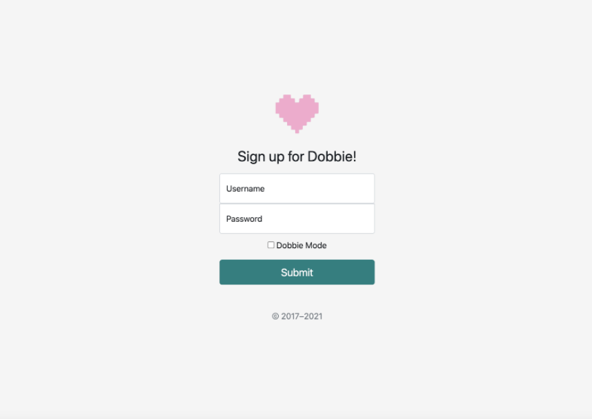
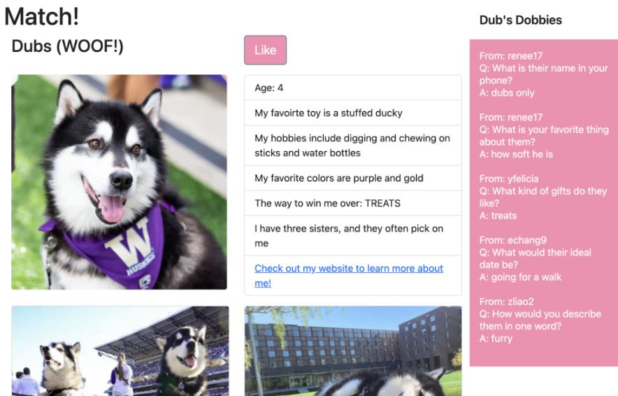
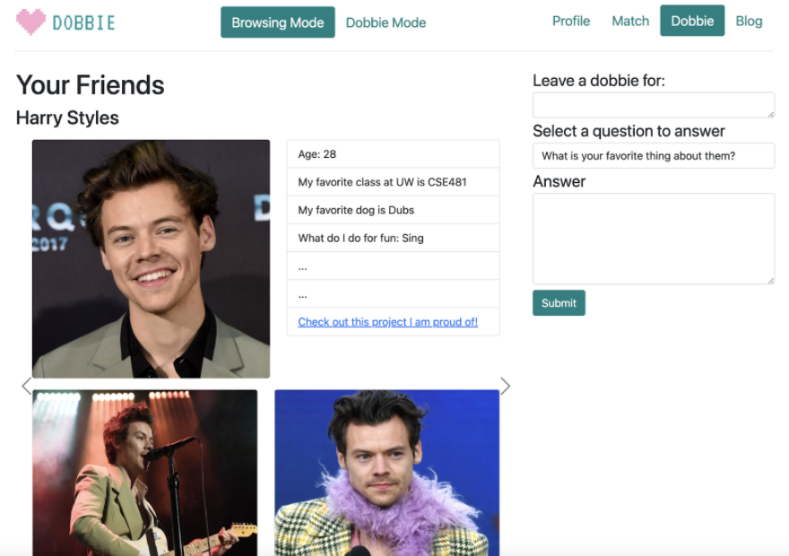

## G6: User Testing on the Medium-Fidelity Prototype

### Medium-Fidelity Prototype
For our medium-fidelity prototype, we implemented the functionality for the log-in page, submitting dobbies, and the two modes for the users. The code can be found in the “dobbie” folder of our GitHub repository, and each main page can be found in a separate HTML file. 
Some functionalities we prototyped via hardcoding were displaying dobbies  on profiles and viewing friends; although we have a database set up, our data is currently hardcoded for demonstration purposes. We also omitted the chat feature of the platform, since that was not a central innovative feature.

### Screenshots
The login screen:

A user profile that someone sees before sending a "like":

The form where users can "Dobbie" their friends:

### User Test Findings
First, we learned that although some people wanted a separate “mode” for non-dating users to support friends, it ended up being more intuitive for users to have a clear “dating” mode and “dobbie” mode. Our current implementation has pages for leaving dobbies while in browsing mode, which confused the testers when they switched to dobbie mode and saw the same page.

Second, we found that users were unsure about the difference between dobbie and browsing mode during signup and after navigating to the home page. This is likely because we did not include any extra information about the two modes or the design of the site. A way that this could be resolved is by including some kind of onboarding material or blurb that informs the user about what the site has to offer.

Third, there were also some interface designs that could be improved (adding visual cues) to help users navigate through the site. For example, the dropdown list of questions for a dobbie does not have a dropdown arrow and looks like a plain text field. To improve this, we could fill the dropdown with a light shade of gray or blue to differentiate it from the actual text fields or add a down arrow to indicate that there are questions to choose from. Another example of an improvement to our interface is that the navigation arrows for the carousel. Right now, they are not very noticeable, resulting in most users not realizing there were multiple profiles they could view.

Fourth, users were confused about the difference (or lack thereof) of the “Your Friends” sidebars on the profile page and dobbie page. For reference, the dobbie page is where a user can see their friend’s profile. Some users suggested that clicking a friend listed on the “Your Friends” sidebar could jump directly to the friend’s profile, or the “Your Friends” list could also be on the dobbie page. We will need to better connect the two components together so the “friends'' functionality is cohesive.

Some features that we will start implementing as we move forward are the profile creation, chat feature, and custom dobbies. As we work on these features, we will be able to slowly move away from some of our wizard-of-oz functionality.

